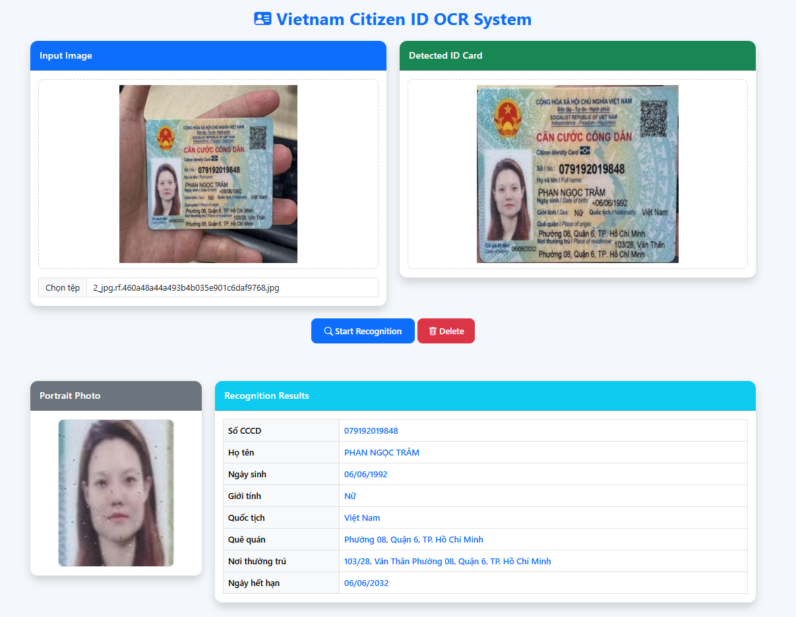

# 🇻🇳 Vietnam Citizen ID OCR System

<p align="center">



</p>

<p align="center">

A FastAPI-based OCR system for Vietnamese Citizen ID Cards using <b>YOLO11</b>, <b>VietOCR</b>, <b>OpenCV</b>, and <b>QR Decoder</b>.

</p>

<p align="center">


</p>

---

# ✨ Features

- 📷 Upload Vietnamese Citizen ID images
- 🎯 Detect and crop ID card using YOLO11 Segmentation
- 📐 Perspective Transformation
- 📝 Detect information fields using YOLO11 Detection
- 👤 Extract portrait photo automatically
- 🔤 OCR using VietOCR
- 🔍 Decode QR Code
- 📄 Return structured JSON results
- 🌐 Beautiful Bootstrap Web Interface
- ⚡ FastAPI REST API

---

# 🏗 System Pipeline

```text
Input Image
      │
      ▼
YOLO11 Card Segmentation
      │
      ▼
Perspective Transform
      │
      ▼
YOLO11 Field Detection
      │
      ├──────────────┐
      ▼              ▼
Portrait Crop     Information Fields
                     │
                     ▼
                 VietOCR
                     │
                     ▼
                QR Decoder
                     │
                     ▼
               Post Processing
                     │
                     ▼
              JSON Response + UI
```

---

# 📸 Demo

<p align="center">


</p>

The system automatically:

- Detects the ID card
- Performs perspective correction
- Extracts the portrait photo
- Recognizes all information fields
- Decodes QR Code
- Displays structured results

---

# 📂 Project Structure

```text
Ocr_cccd
│
├── app
│   ├── models
│   ├── services
│   ├── static
│   ├── templates
│   ├── config.py
│   └── main.py
│
├── assets
│   └── demo.png
│
├── uploads
├── output
│
├── requirements.txt
├── run.py
└── README.md
```

---

# 🚀 Installation

Clone repository

```bash
git clone https://github.com/qhop2507/Vietnam-Citizen-ID-OCR-System.git

cd Vietnam-Citizen-ID-OCR-System
```

Create virtual environment

```bash
python -m venv .venv
```

Activate

Windows

```bash
.venv\Scripts\activate
```

Linux

```bash
source .venv/bin/activate
```

Install dependencies

```bash
pip install -r requirements.txt
```

---

# 📥 Download Models

Place pretrained models into

```text
app/models/
```

Required models

```text
card_seg.pt
field_detector.pt
vgg_transformer.pth
```

---

# ▶️ Run

```bash
python run.py
```

Open

```
http://127.0.0.1:8000
```

---

# 📦 API

### OCR

```
POST /ocr
```

Request

```
multipart/form-data
```

Field

```
image
```

Response

```json
{
  "success": true,
  "card_image": "...",
  "face_image": "...",
  "data": {
    "id": "...",
    "name": "...",
    "dob": "...",
    "gender": "...",
    "nationality": "...",
    "origin_place": "...",
    "current_place": "...",
    "expire_date": "...",
    "qr": "..."
  }
}
```

---

# 🛠 Technologies

- Python
- FastAPI
- OpenCV
- Ultralytics YOLO11
- VietOCR
- PyTorch
- Bootstrap 5

---

# 📈 Future Improvements

- Support batch OCR
- Docker deployment
- ONNX/TensorRT inference
- Mobile application
- Export PDF & Excel
- Multi-language OCR

---

# 👨‍💻 Author


AI Engineer | Computer Vision | OCR | Deep Learning

---

# ⭐ If you like this project

Give this repository a ⭐ Star.